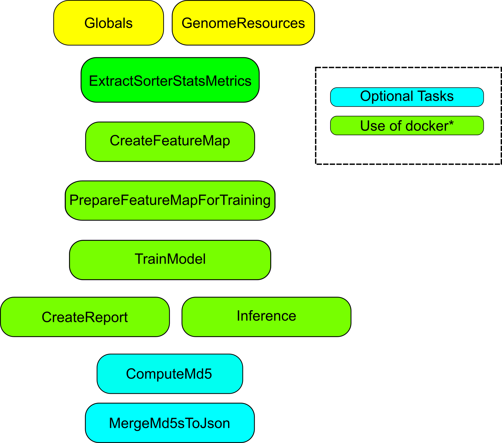

## Single Read SNV (GSI mod)

This repository contains modified code of Ultima Genomics single_read_ssnv workflow ([https://github.com/Ultimagen/healthomics-workflows/tree/main/workflows/single_read_snv](single_read_snv)).
This workflow runs on Ultima NGS data and is capable of calling small variants (SNVs) in either germline or somatic modes.

The Single Read SNV (SRSNV) pipeline is a read-centric de-noising framework, developed to overcome the limitations of traditional locus-centric variant calling, particularly in scenarios where rare mutations may be supported by only a single read. These rare mutations need to be distinguished from artefactual SNVs, which can derive from sequencing, library or alignment errors. To achieve this, we employed a supervised machine learning model trained to classify actual SNVs (labelled True or TP) from noise (False or FP). First, a comprehensive dataset capturing every candidate SNV is generated, along with a rich suite of annotations that describe sequencing quality, local sequence motifs, fragment-specific features, and locus-specific information. Randomly selected bases in the data matching the reference genome are collected and annotated as True, while low VAF (≤5%) SNVs in high-coverage (≥20×) regions (SNVs with low support, indicating they are likely to be artifacts) are annotated as False SNVs. Using these curated sets, we train an XGBoost classifier to robustly distinguish between true and artifactual SNVs. Once trained, the classifier assigns a calibrated quality score to each SNV in the input CRAM, providing a precise estimate of the residual error rate. To avoid overfitting, an ensemble of models (3) are trained on different sets of chromosomes and applied using a cross-validation scheme.

Please treat this repository as a work in progress project as not all of it's elements have been thoroughly tested in production environment.

### Strusture of the workflow

The diagram below outlines the connections between tasks and resource modules, also see below

### Outputs

Output|Type|Description
---|---|---
`featuremap`|File|Feature Map output file in VCF format
`featuremap_index`|File|Feature Map index file
`featuremap_random_sample`|File?|Feature Map random_sample file in VCF format
`featuremap_random_sample_index`|File?|Feature Map random_sample index
`downsampling_rate`|Float|Reported downsampling rate used by CreateFeatureMap.downsampling
`snv_qualities_assigned`|Boolean|Flag which shows if snv qualities can be assigned
`used_self_trained_model`|Boolean|Flag which shows if snv qualities assigned
`raw_filtered_featuremap_parquet`|File?|Filtered featuremap parquet file
`random_sample_trinuc_freq_stats`|File?|File with trinucleotide frequencies, made by CreateFeatureMap
`featuremap_df`|File?|featuremap_df_output
`application_qc_h5`|File?|application qc_h5 output
`report_html`|File?|HTML report
`srsnv_metadata_json`|File?|srsnv metadata json
`model_files`|Array[File]?|model files
`md5_checksums_json`|File?|Optional JSON file produced with MergeMd5sToJson

### Setting up to run in production environment

Single Read SNV uses multiple resources which may be downloaded from Ultima Genomics website(s) and Amazon buckets. A simple bash script is included, although in the nearest future we may switch to using single_read_snv resources wrapped in modules (with Modulator). 

